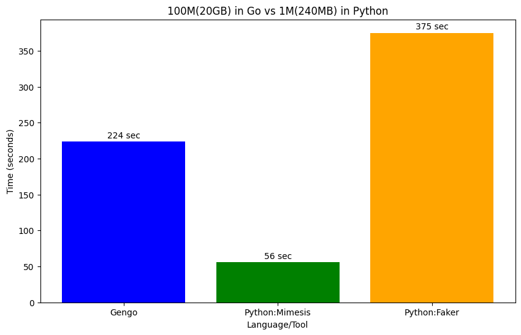
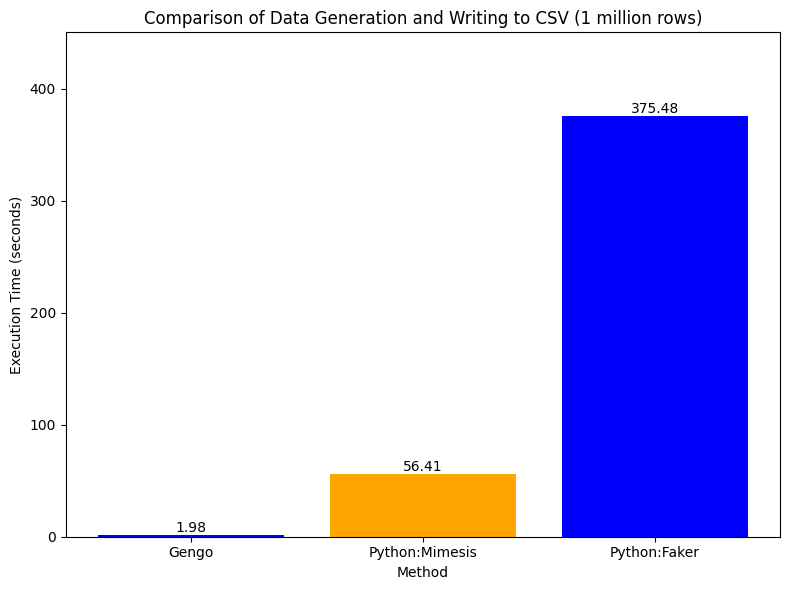
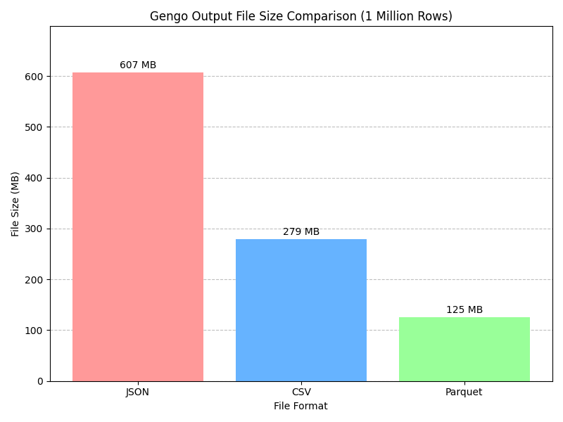
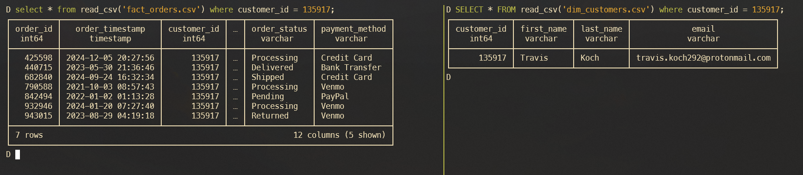

# Gengo 🚀 - Relational Data Model Generator

Gengo is a command-line tool written in Go for rapidly generating large, synthetic **relational datasets** (dimension and fact tables). Need tons of structured fake data for testing data warehouses, BI tools, demos, or benchmarks without waiting forever? Gengo's got your back!

It was originally built because generating millions of rows using scripting languages can often be slow. Go's performance helps speed things up significantly, even when generating related tables.

## Features ✨

- **Fast:** Leverages Go's performance for speedy data generation.
- **Relational Model:** Generates predefined 3NF data models for:
    - **E-commerce:** `dim_customers`, `dim_customer_addresses`, `dim_suppliers`, `dim_products`, `fact_orders_header`, `fact_order_items`
    - **Financial:** `dim_companies`, `dim_exchanges`, `fact_daily_stock_prices`
    - **Medical:** `dim_patients`, `dim_doctors`, `dim_clinics`, `fact_appointments`
- **Multiple Formats:** Output data as **CSV**, **JSON Lines** (one JSON object per line), or efficient **Apache Parquet**.
- **Realistic Facts:** Uses weighted sampling for selecting customers and products when generating orders, simulating more realistic purchasing patterns (e.g., some customers/products appear more frequently).
- **Compressed Parquet:** Generates compressed Parquet files (Snappy by default) for smaller disk usage (one file per table).
- **Size-Based Input:** Tell Gengo the approximate **target size in GB** for the dataset, and it estimates the required row counts for dimensions and facts.
- **Simple Usage:** Interactive command-line prompts guide you through the setup.
- **Customizable Code:** Easily tweak the data generation logic, schema structs, or data realism features within the Go code (uses `brianvoe/gofakeit` and other standard libraries).

## Installation 🛠️

1. **Clone the repo:**

   ```bash
   git clone https://github.com/peekknuf/Gengo.git # Or your repo URL
   ```

2. **Navigate into the directory:**

   ```bash
   cd Gengo
   ```

3. **Ensure dependencies are downloaded:**

   ```bash
   go mod tidy
   ```

4. **Build the binary:**

   ```bash
   go build
   ```

## Usage ⌨️

Simply run the compiled binary with the `gen` command:

```bash
./Gengo gen
```

Gengo will then prompt you interactively:

- Enter the data model to generate: Type `ecommerce`, `financial`, or `medical`. Gengo can handle common misspellings and abbreviations (e.g., `ecom`, `fin`, `med`).

- Enter the approximate target size in GB: (e.g., 0.5, 10, 50). Gengo will display the estimated row counts for each table based on this.

- Enter the desired output format: Type csv, json, or parquet.

- Enter the output directory name: This directory will be created if it doesn't exist, and all generated table files (e.g., dim_customers.parquet, fact_orders.parquet) will be saved inside it.

Gengo will then get to work, showing progress and timing information when complete.

## Customization 🎨

Want different fake data or schema modifications?

- **Schema:** Modify the Go structs in `internal/models/ecommerce/ecommerce.go`, `internal/models/financial/financial.go`, and `internal/models/medical/medical.go`. Remember to update struct tags (`json`, `parquet`) accordingly.
- **Dimension Data:** Change the `gofakeit` functions or logic used within the `Generate*` functions in `internal/simulation/ecommerce/simulate_dims.go`, `internal/simulation/financial/simulate_financial_dims.go`, and `internal/simulation/medical/simulate_medical_dims.go`.
- **Fact Data & Realism:** Adjust the generation logic (e.g., distributions, static lists), foreign key selection (including weighted sampling), or calculation logic within the `Generate*ModelData` functions in `internal/simulation/ecommerce/simulate_facts.go`, `internal/simulation/financial/simulate_financial_facts.go`, and `internal/simulation/medical/simulate_medical_facts.go`.
- **Sizing Ratios:** Modify the constants in `internal/core/sizing.go` to change the relative sizes of the generated tables.

## Benchmarks 📊

**NOTE:** The benchmarks below reflect tests run on a **previous version** of Gengo that generated a single, large, denormalized file. Performance characteristics for generating the multi-table relational model may differ. Pending updated benchmarks. Previous version readily available in the repository's history. Commit: 7638828f147a298e623ad281e794002de4a206a9

**Generation Time (Example: 100 Million Rows in Gengo vs 1 Million Rows in performant Python libraries)**

_Shows how long it took to generate a large dataset._

[](output_100m.png)

**1 Million Rows speed comparison**

[](output_comparison.png)

1 Million Rows size comparison

[](gengo_size_comparison_1M.png)

An actual proof that it follows 3NF

[](proof_of_work.png)

_(Note: Actual performance will vary based on your hardware.)_

Happy generating and playing around with the data!
