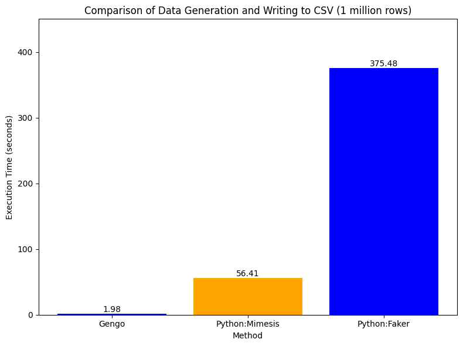

# Gengo 🚀

Gengo is a command-line tool written in Go for rapidly generating large synthetic datasets. Need tons of fake data for testing, demos, or benchmarks without waiting forever? Gengo's got your back!

It was originally built because generating millions (or hundreds of millions!) of rows using scripting languages can often be... well, slow. Go's concurrency and performance help speed things up significantly.

## Features ✨

* **Fast:** Leverages Go's performance and concurrency.
* **Multiple Formats:** Output data as **CSV**, **JSON**, or efficient **Apache Parquet**.
* **Smart Parquet:**
  * Generates **compressed** Parquet files (Snappy by default) for smaller disk usage.
  * Automatically splits output into **multiple `.parquet` files** based on row count (`maxRowsPerFile` constant in the code), making huge datasets easier to handle.
* **Scalable:** Tell it how many rows you need – go big!
* **Simple Schema:** Generates data based on a predefined e-commerce schema (see `cmd/root.go` for details).
* **Customizable:** Easily tweak the data generation logic in the code (it uses the excellent `brianvoe/gofakeit` library).

## Installation 🛠️

1. **Clone the repo:**

    ```bash
    git clone https://github.com/peekknuf/Gengo.git
    ```

2. **Navigate into the directory:**

    ```bash
    cd Gengo
    ```

3. **Ensure dependencies are downloaded (optional, `go build` often handles this):**

    ```bash
    go mod tidy
    ```

4. **Build the binary:**

    ```bash
    go build
    ```

## Usage ⌨️

Simply run the compiled binary with the `gen` command:

```bash
./Gengo gen
```

Gengo will then prompt you interactively:

1. **Enter the number of rows:** You can use underscores for readability (e.g., `1_000_000`).
2. **Enter the desired format:** Type `csv`, `json`, or `parquet`.
3. **Enter the output name:**
    * For `csv` or `json`, this is the **filename** (without extension, e.g., `my_data`). The correct extension will be added automatically.
    * For `parquet`, this is the **directory name** where the `part-*.parquet` files will be saved (e.g., `parquet_output`).

Gengo will then get to work, showing timing information when complete.


*(Preview shows interactive prompts)*

## Customization 🎨

Want different fake data? The generation logic is mainly in the `simulatingData` function within `cmd/root.go`. You can easily change the `gofakeit` functions used for each column or even modify the `Row` struct and the `selectedCols` list to alter the schema.

## Benchmarks 📊

These charts give an idea of performance and output file sizes.

**Generation Time (Example: 100 Million Rows in Gengo vs 1 Million Rows in performant Python libraries)**
*Shows how long it took to generate a large dataset.*
[](output_100m.png)

**1 Million Rows speed comparison**
[](output_comparison.png)

*(Note: Actual performance will vary based on your hardware.)*

---

Happy Generating!
